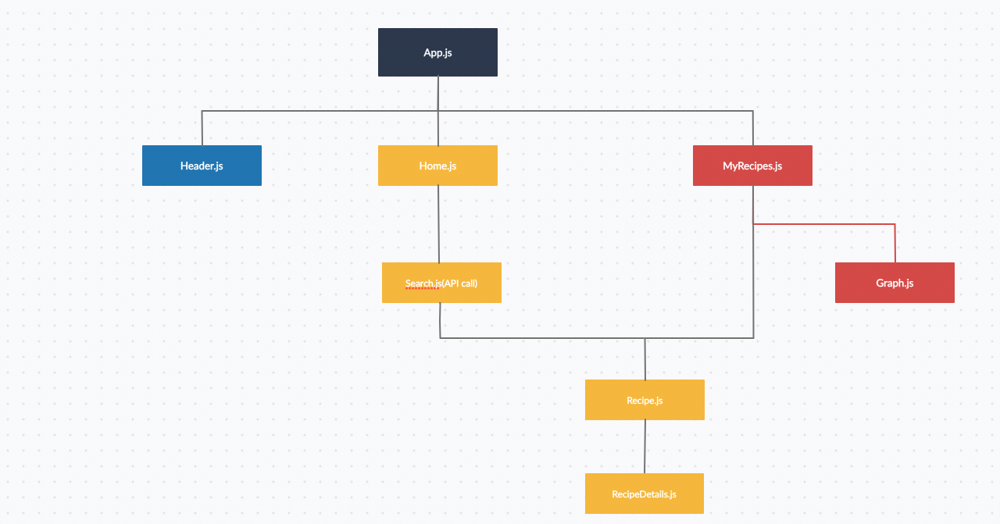

# Project Proposal

## App Description

My web app is called Eatr. It will be powered by the Tasty API, an API that returns receipe data found on Tasty.com. My app will allow users to search for recipes and return nutritional information, ingredient lists, and cooking instructions. Users will be able to add recipes from their search to a "My Recipes" portal, where the users can rate their foods on a variation of the 5 core taste scale (salty, bitter/sour, spicy, sweet, richness/umami). The users' data ratings on each recipe (and their recipes in My Recipes) will be stored in local storage, and the users will be able to compare ratings using a graphical interface on the page. Finally, in the "Recipe Generator" component, the user will be able to return recipes stored in My Recipes based on their desired flavor profile.

## Wireframes

### Homepage


### Search


### Recipe Details


### My Recipes Portal


## User Stories

As a user, I want to be able to search for a recipe in the home page so that I can immediately find recipes without having to navigate the app.

As a user, I also want to be able to be given broad choices such as "pasta" and "soup" in the homepage so that I can receive ideas on what receipes I would like to look at upon opening the app.

As a user, I want to be able to add recipes to a page where I can store them so that I do not have to keep the same page open for weeks/months.

As a user, I want to be able to rate the recipes I have tasted/cooked so that I can reference them at a later time and prepare the recipes according to the tastes that I am craving on the day.

As a user, I want to be able to filter my recipes based on the taste parameters that I have set on a previously saved recipe, so that I can get recipe ideas when I do not know exactly what to cook.

## API Exmaple

Due to my limited amount of API calls and the gargantuan amount of data included in the API call itself, I plan on running fetching the data in only one component, and using useContext to pass the data to the necessary components downfunnel. Most of the API data won't be used.

### JSON example

```json
{
	"count": 1526,
	"results": [
		{
			"language": "eng",
			"user_ratings": {
				"count_positive": 0,
				"score": null,
				"count_negative": 0
			},
			"is_shoppable": true,
			"brand": null,
			"slug": "fresh-basil-parmesan-pesto",
			"num_servings": 12,
			"draft_status": "published",
			"thumbnail_alt_text": "",
			"servings_noun_plural": "servings",
			"beauty_url": null,
			"topics": [
				{ "name": "Best Vegetarian", "slug": "best-vegetarian" },
				{ "slug": "community", "name": "Community Recipes" },
				{ "name": "Vegan", "slug": "vegan" },
				{ "name": "Snacks", "slug": "snacks" }
			],
			"yields": "Servings: 12",
			"facebook_posts": [],
			"prep_time_minutes": null,
			"brand_id": null,
			"name": "Fresh Basil & Parmesan Pesto",
			"compilations": [],
			"original_video_url": null,
			"instructions": [
				{
					"position": 1,
					"display_text": "In a food processor, blend together fresh basil leaves and the pine nuts, pulsing several times until well-chopped and combined. Then, add parmesan cheese and garlic and pulse until well-combined.",
					"start_time": 0,
					"appliance": null,
					"end_time": 0,
					"temperature": null,
					"id": 70776
				},
				{
					"id": 70777,
					"position": 2,
					"display_text": "Slowly stream in the olive oil while pulsing to keep the olive oil from separating.",
					"start_time": 0,
					"appliance": null,
					"end_time": 0,
					"temperature": null
				},
				{
					"end_time": 0,
					"temperature": null,
					"id": 70778,
					"position": 3,
					"display_text": "Season lightly with salt and pepper to taste.",
					"start_time": 0,
					"appliance": null
				},
				{
					"appliance": null,
					"end_time": 0,
					"temperature": null,
					"id": 70779,
					"position": 4,
					"display_text": "Serve over pasta or refrigerate in a sealed container.",
					"start_time": 0
				}
			],
			"id": 8127,
			"show_id": 17,
			"is_one_top": false,
			"renditions": [],
			"total_time_tier": {
				"tier": "under_30_minutes",
				"display_tier": "Under 30 minutes"
			},
			"video_id": null,
			"servings_noun_singular": "serving",
			"sections": [
				{
					"components": [
						{
							"position": 1,
							"measurements": [
								{
									"unit": {
										"system": "imperial",
										"name": "cup",
										"display_plural": "cups",
										"display_singular": "cup",
										"abbreviation": "c"
									},
									"quantity": "2",
									"id": 683489
								},
								{
									"unit": {
										"system": "metric",
										"name": "gram",
										"display_plural": "g",
										"display_singular": "g",
										"abbreviation": "g"
									},
									"quantity": "80",
									"id": 683488
								}
							],
							"raw_text": "2 cups fresh basil leaves",
							"extra_comment": "",
							"ingredient": {
								"display_singular": "fresh basil leaf",
								"updated_at": 1509035174,
								"name": "fresh basil leaf",
								"created_at": 1496948747,
								"display_plural": "fresh basil leaves",
								"id": 1664
							},
							"id": 92695
						},
						{
							"raw_text": "¼ cup grated parmesan cheese",
							"extra_comment": "",
							"ingredient": {
								"updated_at": 1509035159,
								"name": "grated parmesan cheese",
								"created_at": 1497741203,
								"display_plural": "grated parmesan cheeses",
								"id": 1869,
								"display_singular": "grated parmesan cheese"
							},
							"id": 92696,
							"position": 2,
							"measurements": [
								{
									"unit": {
										"system": "imperial",
										"name": "cup",
										"display_plural": "cups",
										"display_singular": "cup",
										"abbreviation": "c"
									},
									"quantity": "¼",
									"id": 683494
								},
								{
									"unit": {
										"system": "metric",
										"name": "gram",
										"display_plural": "g",
										"display_singular": "g",
										"abbreviation": "g"
									},
									"quantity": "30",
									"id": 683491
								}
							]
						},
						{
							"raw_text": "1 tbsp minced garlic",
							"extra_comment": "minced",
							"ingredient": {
								"display_singular": "garlic",
								"updated_at": 1509035285,
								"name": "garlic",
								"created_at": 1493744766,
								"display_plural": "garlics",
								"id": 95
							},
							"id": 92697,
							"position": 3,
							"measurements": [
								{
									"unit": {
										"name": "tablespoon",
										"display_plural": "tablespoons",
										"display_singular": "tablespoon",
										"abbreviation": "tbsp",
										"system": "imperial"
									},
									"quantity": "1",
									"id": 683497
								}
							]
						},
						{
							"raw_text": "¼ cup pine nuts",
							"extra_comment": "",
							"ingredient": {
								"created_at": 1496090720,
								"display_plural": "pine nuts",
								"id": 935,
								"display_singular": "pine nut",
								"updated_at": 1509035221,
								"name": "pine nuts"
							},
							"id": 92698,
							"position": 4,
							"measurements": [
								{
									"unit": {
										"abbreviation": "c",
										"system": "imperial",
										"name": "cup",
										"display_plural": "cups",
										"display_singular": "cup"
									},
									"quantity": "¼",
									"id": 683493
								},
								{
									"quantity": "30",
									"id": 683490,
									"unit": {
										"system": "metric",
										"name": "gram",
										"display_plural": "g",
										"display_singular": "g",
										"abbreviation": "g"
									}
								}
							]
						},
						{
							"extra_comment": "",
							"ingredient": {
								"id": 452,
								"display_singular": "extra virgin olive oil",
								"updated_at": 1509035259,
								"name": "extra virgin olive oil",
								"created_at": 1495076759,
								"display_plural": "extra virgin olive oils"
							},
							"id": 92699,
							"position": 5,
							"measurements": [
								{
									"quantity": "⅓",
									"id": 683495,
									"unit": {
										"display_singular": "cup",
										"abbreviation": "c",
										"system": "imperial",
										"name": "cup",
										"display_plural": "cups"
									}
								},
								{
									"unit": {
										"system": "metric",
										"name": "gram",
										"display_plural": "g",
										"display_singular": "g",
										"abbreviation": "g"
									},
									"quantity": "80",
									"id": 683492
								}
							],
							"raw_text": "⅓ cup extra virgin olive oil"
						},
						{
							"measurements": [
								{
									"id": 683496,
									"unit": {
										"display_singular": "",
										"abbreviation": "",
										"system": "none",
										"name": "",
										"display_plural": ""
									},
									"quantity": "0"
								}
							],
							"raw_text": "Salt and pepper, to taste",
							"extra_comment": "to taste",
							"ingredient": {
								"updated_at": 1591200156,
								"name": "salt and pepper",
								"created_at": 1591200156,
								"display_plural": "salt and peppers",
								"id": 6483,
								"display_singular": "salt and pepper"
							},
							"id": 92700,
							"position": 6
						}
					],
					"name": null,
					"position": 1
				}
			],
			"show": { "name": "Tasty", "id": 17 },
			"video_url": null,
			"credits": [{ "name": "Jennifer Beylard", "type": "community" }],
			"canonical_id": "recipe:8127",
			"country": "US",
			"keywords": "",
			"tags": [
				{
					"id": 64469,
					"display_name": "Vegetarian",
					"type": "dietary",
					"name": "vegetarian"
				},
				{
					"name": "vegan",
					"id": 64468,
					"display_name": "Vegan",
					"type": "dietary"
				},
				{
					"type": "meal",
					"name": "appetizers",
					"id": 64481,
					"display_name": "Appetizers"
				},
				{
					"name": "snacks",
					"id": 64491,
					"display_name": "Snacks",
					"type": "meal"
				},
				{
					"name": "food_processor",
					"id": 65842,
					"display_name": "Food Processor",
					"type": "appliance"
				},
				{
					"id": 64472,
					"display_name": "Under 30 Minutes",
					"type": "difficulty",
					"name": "under_30_minutes"
				},
				{
					"display_name": "Easy",
					"type": "difficulty",
					"name": "easy",
					"id": 64471
				},
				{
					"display_name": "Casual Party",
					"type": "occasion",
					"name": "casual_party",
					"id": 64503
				}
			],
			"inspired_by_url": null,
			"updated_at": 1646162554,
			"approved_at": 1646162553,
			"nutrition_visibility": "auto",
			"nutrition": {
				"carbohydrates": 0,
				"fiber": 0,
				"updated_at": "2022-02-26T07:10:15+01:00",
				"protein": 1,
				"fat": 8,
				"calories": 81,
				"sugar": 0
			},
			"tips_and_ratings_enabled": true,
			"created_at": 1645483324,
			"description": "",
			"total_time_minutes": null,
			"seo_title": "",
			"cook_time_minutes": null,
			"promotion": "full",
			"buzz_id": null,
			"aspect_ratio": "16:9",
			"thumbnail_url": "https://img.buzzfeed.com/tasty-app-user-assets-prod-us-east-1/recipes/c4bdaa0c3e0a441d9ab90be8700e9aab.jpeg",
			"video_ad_content": null
		},
		{
			"prep_time_minutes": null,
			"nutrition": {
				"updated_at": "2022-02-19T07:10:57+01:00",
				"protein": 2,
				"fat": 6,
				"calories": 91,
				"sugar": 2,
				"carbohydrates": 7,
				"fiber": 1
			},
			"thumbnail_alt_text": "",
			"is_one_top": false,
			"servings_noun_plural": "servings",
			"keywords": "",
			"user_ratings": {
				"count_positive": 0,
				"score": null,
				"count_negative": 0
			},
			"servings_noun_singular": "serving",
			"canonical_id": "recipe:8113",
			"name": "Roasted Moroccan Carrots With Baba Ganoush",
			"compilations": [],
			"draft_status": "published",
			"approved_at": 1646078130,
			"total_time_tier": {
				"tier": "under_30_minutes",
				"display_tier": "Under 30 minutes"
			},
			"instructions": [
				{
					"position": 1,
					"display_text": "Place carrots on a baking dish lined with baking paper. Drizzle with olive oil, salt and paprika.",
					"start_time": 0,
					"appliance": null,
					"end_time": 0,
					"temperature": null,
					"id": 70687
				},
				{
					"start_time": 0,
					"appliance": "oven",
					"end_time": 0,
					"temperature": 356,
					"id": 70688,
					"position": 2,
					"display_text": "Bake at 180°C until tender – approx. 20 minutes."
				},
				{
					"display_text": "To plate the dish, spread the baba ganoush across the bottom of the entireR plate. Lay the roast carrots on the baba ganoush and top with corn and pistachio nuts.",
					"start_time": 0,
					"appliance": null,
					"end_time": 0,
					"temperature": null,
					"id": 70689,
					"position": 3
				}
			],
			"brand_id": null,
			"tags": [
				{
					"name": "oven",
					"id": 65846,
					"display_name": "Oven",
					"type": "appliance"
				},
				{
					"name": "vegan",
					"id": 64468,
					"display_name": "Vegan",
					"type": "dietary"
				},
				{
					"display_name": "Vegetarian",
					"type": "dietary",
					"name": "vegetarian",
					"id": 64469
				},
				{
					"type": "dietary",
					"name": "healthy",
					"id": 64466,
					"display_name": "Healthy"
				},
				{
					"name": "under_30_minutes",
					"id": 64472,
					"display_name": "Under 30 Minutes",
					"type": "difficulty"
				},
				{
					"name": "easy",
					"id": 64471,
					"display_name": "Easy",
					"type": "difficulty"
				},
				{
					"name": "weeknight",
					"id": 64505,
					"display_name": "Weeknight",
					"type": "occasion"
				},
				{
					"name": "bake",
					"id": 64492,
					"display_name": "Bake",
					"type": "method"
				},
				{
					"name": "lunch",
					"id": 64489,
					"display_name": "Lunch",
					"type": "meal"
				}
			],
			"id": 8113,
			"brand": null,
			"num_servings": 8,
			"is_shoppable": true,
			"video_id": null,
			"nutrition_visibility": "auto",
			"facebook_posts": [],
			"language": "eng",
			"tips_and_ratings_enabled": true,
			"thumbnail_url": "https://img.buzzfeed.com/tasty-app-user-assets-prod-us-east-1/recipes/f99eecda92ad4aa18d14b5f2130169f4.jpeg",
			"updated_at": 1646078130,
			"credits": [{ "name": "Fiona Anchal", "type": "community" }],
			"beauty_url": null,
			"country": "US",
			"slug": "roasted-moroccan-carrots-with-baba-ganoush",
			"buzz_id": null,
			"original_video_url": null,
			"promotion": "full",
			"description": "",
			"total_time_minutes": null,
			"topics": [
				{ "name": "Best Vegetarian", "slug": "best-vegetarian" },
				{ "name": "Community Recipes", "slug": "community" },
				{ "name": "Healthy Eating", "slug": "healthy" },
				{ "name": "Vegan", "slug": "vegan" },
				{ "name": "Lunch", "slug": "lunch" }
			],
			"video_url": null,
			"renditions": [],
			"video_ad_content": null,
			"cook_time_minutes": null,
			"sections": [
				{
					"components": [
						{
							"raw_text": "1 bunch Dutch carrots, washed and tops trimmed",
							"extra_comment": "washed and tops trimmed",
							"ingredient": {
								"updated_at": 1645109031,
								"name": "dutch carrots",
								"created_at": 1645109031,
								"display_plural": "dutch carrots",
								"id": 9581,
								"display_singular": "dutch carrot"
							},
							"id": 92523,
							"position": 1,
							"measurements": [
								{
									"unit": {
										"display_singular": "bunch",
										"abbreviation": "bunch",
										"system": "none",
										"name": "bunch",
										"display_plural": "bunches"
									},
									"quantity": "1",
									"id": 683464
								}
							]
						},
						{
							"raw_text": "2 large purple carrots, washed and tops trimmed",
							"extra_comment": "washed and tops trimmed",
							"ingredient": {
								"updated_at": 1606169464,
								"name": "large purple carrot",
								"created_at": 1606169464,
								"display_plural": "large purple carrots",
								"id": 7558,
								"display_singular": "large purple carrot"
							},
							"id": 92524,
							"position": 2,
							"measurements": [
								{
									"quantity": "2",
									"id": 683458,
									"unit": {
										"abbreviation": "",
										"system": "none",
										"name": "",
										"display_plural": "",
										"display_singular": ""
									}
								}
							]
						},
						{
							"raw_text": "2 tbsp olive oil",
							"extra_comment": "",
							"ingredient": {
								"updated_at": 1509035290,
								"name": "olive oil",
								"created_at": 1493306183,
								"display_plural": "olive oils",
								"id": 4,
								"display_singular": "olive oil"
							},
							"id": 92525,
							"position": 3,
							"measurements": [
								{
									"unit": {
										"system": "imperial",
										"name": "tablespoon",
										"display_plural": "tablespoons",
										"display_singular": "tablespoon",
										"abbreviation": "tbsp"
									},
									"quantity": "2",
									"id": 683460
								}
							]
						},
						{
							"raw_text": "1 tsp salt",
							"extra_comment": "",
							"ingredient": {
								"updated_at": 1509035288,
								"name": "salt",
								"created_at": 1493314644,
								"display_plural": "salts",
								"id": 22,
								"display_singular": "salt"
							},
							"id": 92526,
							"position": 4,
							"measurements": [
								{
									"unit": {
										"display_singular": "teaspoon",
										"abbreviation": "tsp",
										"system": "imperial",
										"name": "teaspoon",
										"display_plural": "teaspoons"
									},
									"quantity": "1",
									"id": 683462
								}
							]
						},
						{
							"raw_text": "1 tsp paprika",
							"extra_comment": "",
							"ingredient": {
								"display_plural": "paprikas",
								"id": 42,
								"display_singular": "paprika",
								"updated_at": 1509035286,
								"name": "paprika",
								"created_at": 1493430149
							},
							"id": 92527,
							"position": 5,
							"measurements": [
								{
									"unit": {
										"display_singular": "teaspoon",
										"abbreviation": "tsp",
										"system": "imperial",
										"name": "teaspoon",
										"display_plural": "teaspoons"
									},
									"quantity": "1",
									"id": 683459
								}
							]
						},
						{
							"extra_comment": "boiled and shucked",
							"ingredient": {
								"updated_at": 1509035266,
								"name": "corn",
								"created_at": 1494974377,
								"display_plural": "corns",
								"id": 371,
								"display_singular": "corn"
							},
							"id": 92528,
							"position": 6,
							"measurements": [
								{
									"unit": {
										"display_plural": "",
										"display_singular": "",
										"abbreviation": "",
										"system": "none",
										"name": ""
									},
									"quantity": "1",
									"id": 683463
								}
							],
							"raw_text": "1 cob of corn, boiled and shucked"
						},
						{
							"id": 92529,
							"position": 7,
							"measurements": [
								{
									"id": 683467,
									"unit": {
										"display_plural": "cups",
										"display_singular": "cup",
										"abbreviation": "c",
										"system": "imperial",
										"name": "cup"
									},
									"quantity": "¼"
								},
								{
									"quantity": "30",
									"id": 683466,
									"unit": {
										"system": "metric",
										"name": "gram",
										"display_plural": "g",
										"display_singular": "g",
										"abbreviation": "g"
									}
								}
							],
							"raw_text": "¼ cup pistachio nuts, chopped",
							"extra_comment": "chopped",
							"ingredient": {
								"updated_at": 1509410956,
								"name": "pistachio",
								"created_at": 1509410956,
								"display_plural": "pistachios",
								"id": 3170,
								"display_singular": "pistachio"
							}
						},
						{
							"position": 8,
							"measurements": [
								{
									"unit": {
										"name": "cup",
										"display_plural": "cups",
										"display_singular": "cup",
										"abbreviation": "c",
										"system": "imperial"
									},
									"quantity": "½",
									"id": 683465
								},
								{
									"unit": {
										"abbreviation": "g",
										"system": "metric",
										"name": "gram",
										"display_plural": "g",
										"display_singular": "g"
									},
									"quantity": "85",
									"id": 683461
								}
							],
							"raw_text": "1⁄2 cup of Baba Ganoush",
							"extra_comment": "",
							"ingredient": {
								"created_at": 1645109108,
								"display_plural": "Baba Ganoushes",
								"id": 9582,
								"display_singular": "Baba Ganoush",
								"updated_at": 1645109108,
								"name": "Baba Ganoush"
							},
							"id": 92530
						}
					],
					"name": null,
					"position": 1
				}
			],
			"aspect_ratio": "16:9",
			"inspired_by_url": null,
			"show_id": 17,
			"show": { "name": "Tasty", "id": 17 },
			"created_at": 1644856593,
			"seo_title": "",
			"yields": "Servings: 8"
		}
	]
}
```

## App Components/Routing Map



## Third-Party Libraries

Animate.css - for home page animations
Chart.js - for MyRecipe comparison functionality
